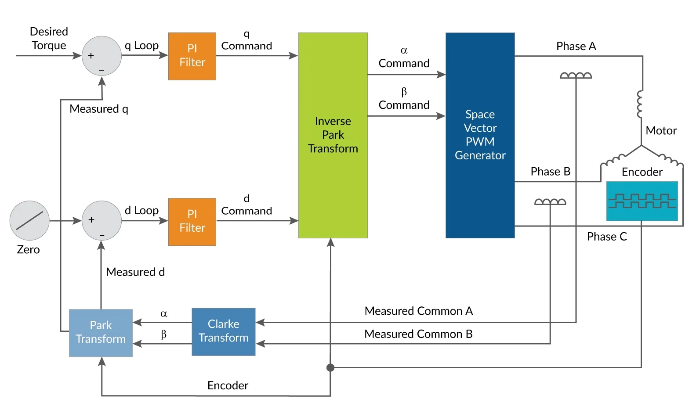

# BLDC motor control

* The BLDC motor is a three-phase synchronous motor with stator composed of three-phase windings 
  * Concentrated windings for trapezoidal-BLDC motor
  * Sinusoidally distributed windings for sine-BLDC motor 
  * A rotor having permanent magnets (or vice versa in exterior rotor PM motors)

* There are no mechanical brushes present
* Normal DC motors have wear and tear, sparks and EMI problems

## How these work ?
* All motors have a magnetized rotating shaft called the rotor. 
* The rotor is surrounded by the armature, which is also magnetized in some manner. 
* The differences in polarity between the armature and the rotor create a force causing the rotor to rotate inside the armature. 
* Unlike brushed motors, which use electromagnets on the armature, the electromagnets in a BLDC motor are positioned on the rotor, and permanent magnets are placed on the armature.  
* This arrangement allows the motor to operate without the need for physical brushes inside the motor. 
* Without brushes, the motor does need an external control system to switch polarity on the electromagnets to spin the rotor in a complete rotation.


## Some points to remember

* BLDC motors generally consist of three permanent magnets in the stator placed 120 degrees apart. 
* An orthogonal force is generated as the rotor’s electromagnets are energized inside the permanent magnets on the stator. 
* The shaft can then start to spin, during this phase, the forces on the shaft begin to change from orthogonal or direct to quadrature or flux. 
* If the state of the electromagnets does not change, the motor will stall as the magnetic fields reach equilibrium and the flux component is maximized.  

## Overview of Methods

* Algorithms:
  * Trapezoidal
  * Sinusoidal
  * Sensored & Sensorless
  * Current control

- Generally Hall-effect sensors are used to get the rotor position
- Hall effect sensors make a square transition when switching current values; this is where the inefficiencies lie.
- While this method works, it will lag when motor speeds reach their maximum

* Trapezoidal control: 
  * 6-step control
  * Simplest algorithm - For each of the 6 commutation steps, a current path is formed between a pair of windings, leaving the third winding disconnected. 
  * Generates high torque ripple, leading to vibration, noise, and poorer performance compared to other algorithms.

* Sinusoidal control: 
  * Voltage-over-frequency commutation
  * Supplying smoothly (sinusoidal) varying current to the 3 windings
  * Reduces the torque ripple and offering a smooth rotation. 
  * However, these time-varying currents are controlled using basic PI regulators, which lead to poor performance at higher speeds.

* Field Oriented Control (FOC): 
  * Vector control
  * The stator currents are measured and adjusted so that the angle between the rotor and stator flux is 90 degrees to achieve the maximum torque.
  * Operates on the resultant vector of the three phase currents rather than controlling each phase independently
  * Better efficiency at higher speeds than sinusoidal control. 
  * Optimized efficiency even during transient operation by perfectly maintaining the stator and rotor fluxes.
  * Gives better performance on dynamic load changes when compared to all other techniques. 


* The position of the rotor and the phase of the magnetic field need to be known entities to provide torque to the motor shaft. 
```
Ia + Ib + Ic = 0
Ia,Ib,Ic ==> Iq, Id  (In phase and quadrature phase currents)  
         ==> I_alpha, I_beta  (Clarke transform (named after Edith Clarke) converts vectors in the ABC reference frame to the αβγ reference frame)
```

* Id reference controls the rotor magnetizing flux. 
* Iq reference controls the torque output of the motor.

 

* References
  1. [EE Times](https://www.eetimes.com/implementing-field-oriented-control-of-a-brushless-dc-motor/)
  2. [Control.com](https://control.com/technical-articles/field-oriented-control-vector-control-for-brushless-dc-motors/)

* Related
  * [Python Sim. for FOC](https://github.com/dbking77/foc_sim)