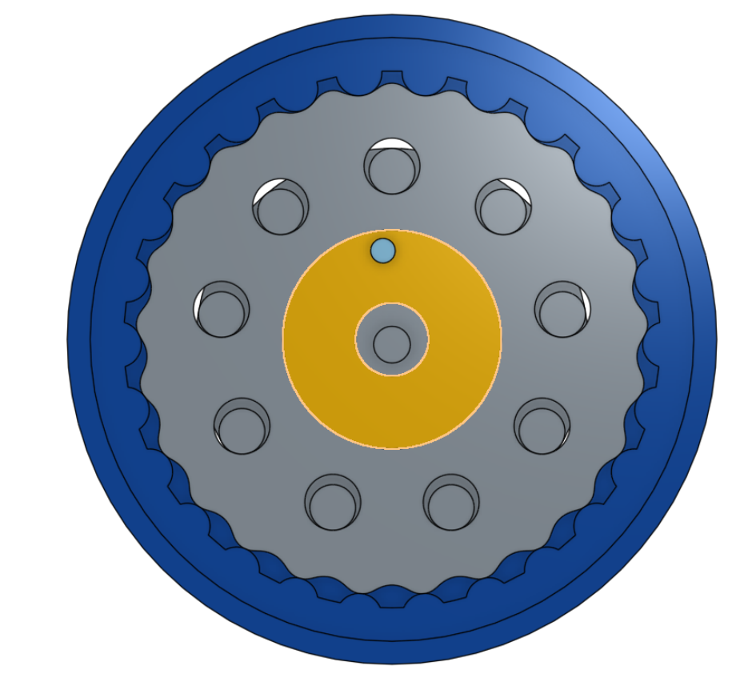

# TABLE OF CONTENTS
- [TitanLegs : Quadruped Actuator](#1)
  - [Gearbox](#2)

# Titan Legs 

* Quadruped with 2 DoF legs

# Gearbox Design 

* First conceptual prototype of cycloidal gearbox
* Modelled in OnShape, you can access the model [here](https://cad.onshape.com/documents/b8c9b425195788ed5b59f624/w/1e0063439de5adffabcff9e9/e/5c14e1911b99b76c077226d1)

  

